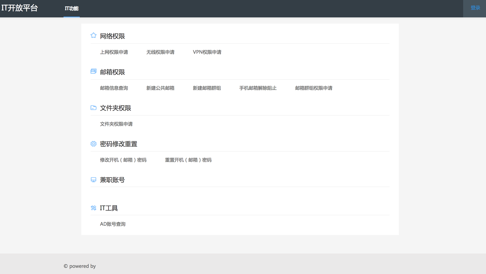

# IT-Portal
基于Python+Django的AD\Exchange用户自助平台
---
ITPortal 是一个用户自助化的企业内部相关IT权限申请平台,可以自助申请AD账号、邮箱、共享、上网权限等。极大的解放了IT运维人员，方便账号权限的统一管理。

项目包含三部分的内容

`core:` 此项目包含全部与AD交互的相关API，除本项目调用之外，还可以提供给企业其他的项目信息化时调用。

`portal:` 此项目包含用户交互页面以及管理配置功能

`plugins:` 此项目包含第三方相关的一些接口,目前包含DFS(常规文件共享)的相关操作接口

#### 系统截图

## 部署说明
## 环境需求

服务器角色 | .NetFrameWork|PowerShell|Python|
---|---|---|---|
AD服务器 | 4.6|无要求|无要求
Exchange服务器 |4.6 | 4.0|无要求
文件共享服务器|4.6|无要求|无要求

**请按照如下文档调整AD/Exchange配置**

[AD\Exchange服务器基础配置](docs/AD-EX-config.md)

### [core部署文档](./core/README.md)
### [portal部署文档](./portal/README.md)
### [plugins dfs部署说明](./plugins/dfs/README.md)

## 配置使用说明

## 接口说明

## 

## TODO

- [] core代码使用Python重构
