# core

该系统提供提供了所有AD、Exchange相关的接口，目前基于`C#` 开发。

# 部署说明


##  1.添加IIS功能

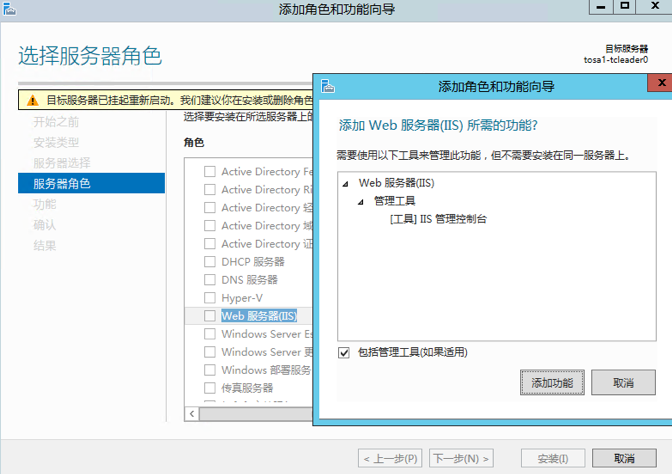

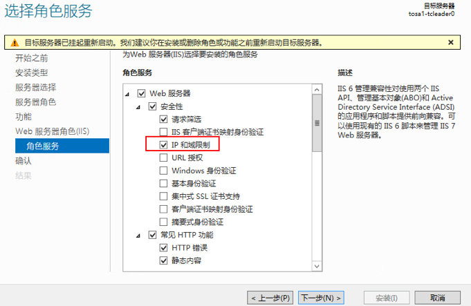

勾选以下相关的角色
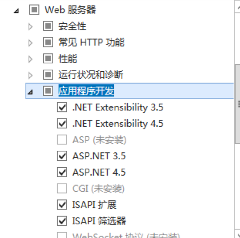

添加.net 3.5功能

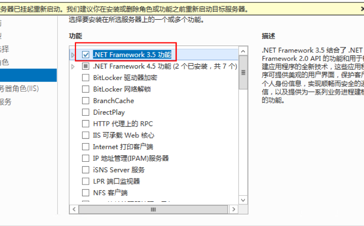

安装完成后重启计算机

打开组策略 计算机配置—— 管理模板——windows组件——windows 远程管理（WinRm）——WinRM客户端

> 启用允许未加密通信

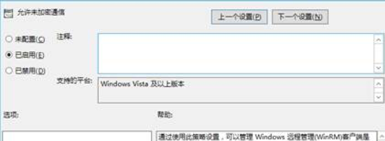

> 配置 受信任的主机 启用，可指定ip，*代表允许所有。


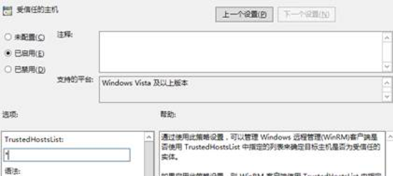

## 2.配置IIS

拷贝本目录下的**release**到D盘根目录 并重命名为 **itapi**

打开IIS管理器,右键添加网站

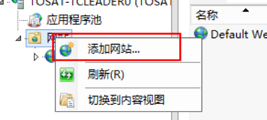

输入网站名称，设置物理路径，设置ip，端口

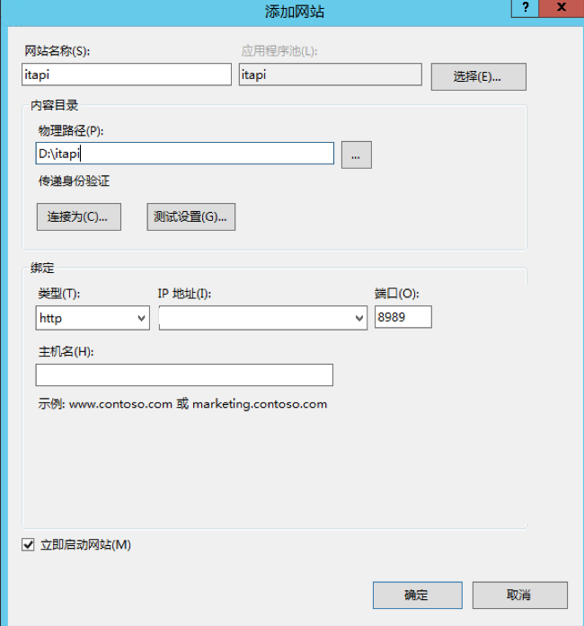

设置完成后点击浏览网站测试是否成功([如遇报错请参见报错部分](#user-content-3.常见报错))

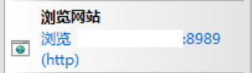

如看到下图则表示IIS部署成功

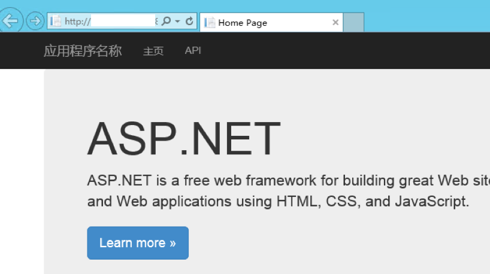

在浏览器输入本机IP地址+端口+/api/adapi/iisonlinetest，可以测试看到接口是否正常工作


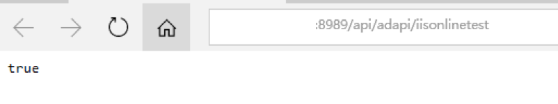

## 3.常见报错

1. 配置项无法更改

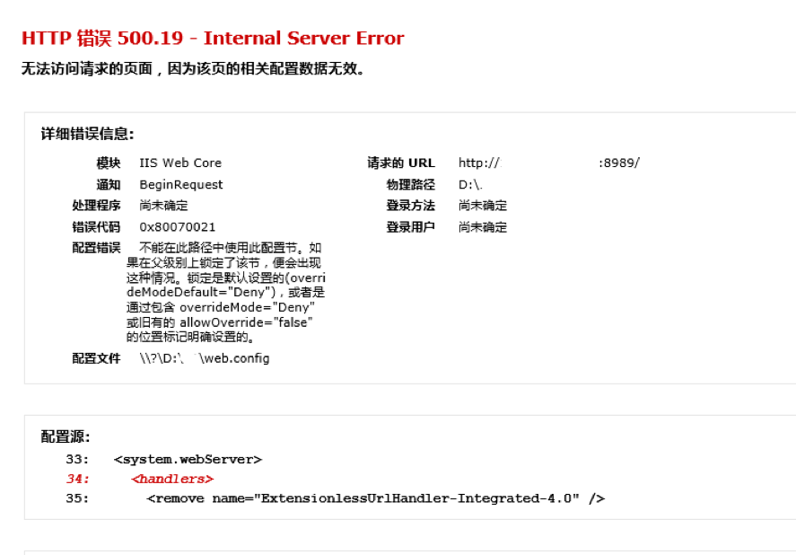

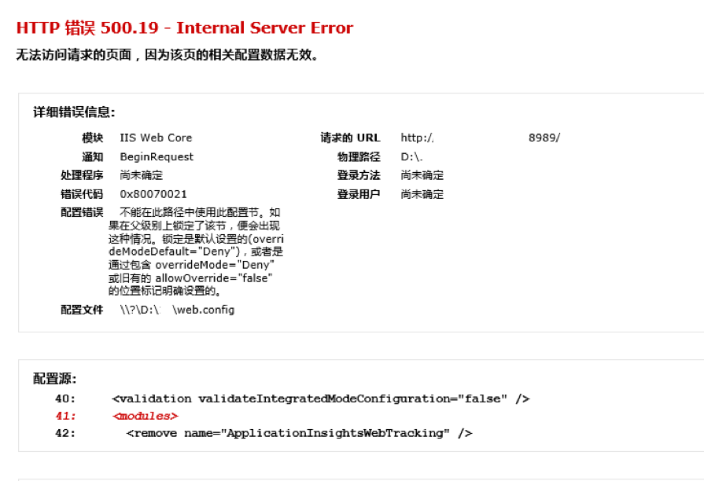

出现这个错误是因为 IIS 7 采用了更安全的 web.config 管理机制，默认情况下会锁住配置项不允许更改。要取消锁定可以以管理员身份运行命令行
```
 %windir%\system32\inetsrv\appcmd unlock config -section:system.webServer/handlers 
 ```
 
 。其中的 **handlers** 是错误信息中红字显示的节点名称。同理如果modules也被锁定，可以运行
```
%windir%\system32\inetsrv\appcmd unlock config -section:system.webServer/modules
```


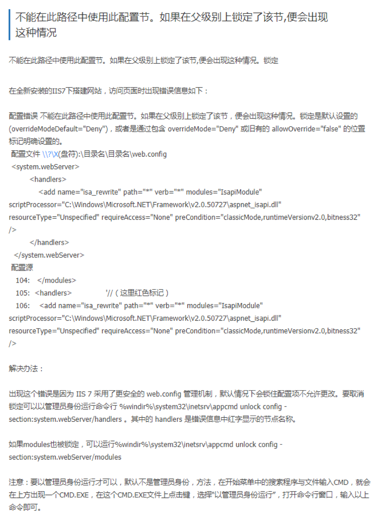

