## 调整AD查询数量限制

因为windows server本身出于性能负荷的考虑，默认将LDAP查询的数量限制为1000个。当AD中的条目（user/group/ou）数量超过1000条时，使用LDAP查询工具进行查询时，就会导致查询结果返回出错。
如果AD目录中，实际的users超过了1000个，会导致导入用户时，就会有出错信息提示。而且每次最多也只能够导入1000个用户。
解决办法是：在根域主机中，修改查询数量限制。具体步骤如下：
```
1. 在“开始”-〉“运行”-〉输入：“ ntdsutil”，回车；
2. 输入：“ldap policies”,回车；
3. 输入：“connections”，回车；
4. 输入：“connect to domain 当前域名”举例:域名是：opscaff.com
5. 连接提示出现后，输入：“quit”，回车；
6. 输入：“show values”，确认当前的最大返回数；（默认是1000）
7. 输入：“set maxpagesize to 10000”，将最大返回数改为10000。（最大返回数可以根据实际情况自行定义）。
8. 再度输入：“show values”，确认当前的最大返回数（显示为：1000（10000））。
9. 输入“commit changes”以确认修改。
10. 再次输入：“show values”，确认当前的最大返回数为10000。
11. 输入“quit”，退出设置状态；
12. 输入“quit”，退出当前命令。
 ```
请根据上面的方法设置 MaxPageSize 和 MaxValRange的值，具体设置值得大小，请根据公司实际情况设置
 

## Exchange服务器PowerShell安装配置

### 升级powershell为4.0版本

> 任意一台exchange服务器升级即可（平台配置exchange服务器需要是升级后的exchange服务器ip）

* 打开powershell，输入get-host命令检查powershell版本，如下就是2.0版本

```powershell
PS C:\> get-host


Name             : ConsoleHost
Version          : 2.0
InstanceId       : 216xaxff-3x18-4xec-9xb4-bxx3862d97ef
UI               : System.Management.Automation.Internal.Host.InternalHostUserInterface
CurrentCulture   : zh-CN
CurrentUICulture : zh-CN
PrivateData      : Microsoft.PowerShell.ConsoleHost+ConsoleColorProxy
IsRunspacePushed : False
Runspace         : System.Management.Automation.Runspaces.LocalRunspace
```

* powershell升级4.0[点击进入下载页面](https://www.microsoft.com/zh-CN/download/details.aspx?id=40855)，根据系统位数选择**Windows6.1-KB2819745**的64或32位安装包，下载安装后重启服务器，然后检查powershell版本，看到如下提示即可

```powershell
PS C:\> get-host


Name             : ConsoleHost
Version          : 4.0
InstanceId       : 56e67xx4-dx65-4xaf-8x2f-354134031adc
UI               : System.Management.Automation.Internal.Host.InternalHostUserInterface
CurrentCulture   : zh-CN
CurrentUICulture : zh-CN
PrivateData      : Microsoft.PowerShell.ConsoleHost+ConsoleColorProxy
IsRunspacePushed : False
Runspace         : System.Management.Automation.Runspaces.LocalRunspace
```


### 配置远程powershell连接身份认证

> 在升级powershell4.0的服务器上开启powershell身份认证功能

* 依次点击开始——管理工具——IIS管理器——网站——Default Web Site，单击powershell后，找到中间IIS类别下的**身份验证**，双击进入，右键启用基本身份验证。
* 重启IIS，打开powershell，输入iisreset命令，看到如下提示后即可

```powershell
PS C:\> iisreset
正在尝试停止...
Internet 服务已成功停止
正在尝试启动...
Internet 服务已成功启动
```


## 多元密码策略设置(防锁定功能需要)

**要求：AD2008及以上**

1.运行 Adsiedit.msc

2.链接到默认命名上下文

3.然后打开```CN=System--CN=Password Settings Container```

4.在CN=Password Settings Container新建对象，在弹出的对话框中选中“msDS-PasswordSettings”类别

5.在cn属性对话框中输入“值”为“NoLock”(任意)。然后一路“下一步”依据向导进行密码策略的定制。其具体的设置项、含义和值分别为：

(1)```.msDS-PasswordSettingsPrecedence```，设置密码策略的优先级，数值越小优先级越高，设置为“1”;

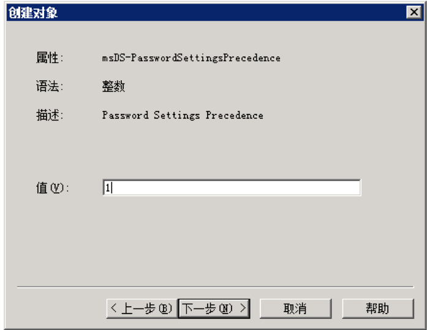
 
(2)```.msDS-PasswordReversibleEncryptionEnabled```，置设是否启用“用可还原的加密来存储密码”策略，可选择FALSE或者TRUE，在此我们设置为“FALSE”;
 
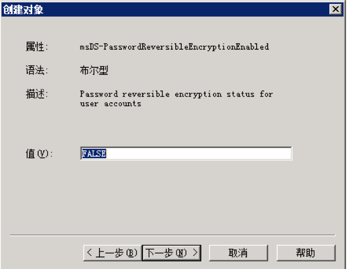
 
(3)```.msDS-PasswordHistoryLength```，对应组策略中的“强制密码历史”，可选范围是0-1024，我们设置为3;

**注意：此处请和自己域密码策略一致**


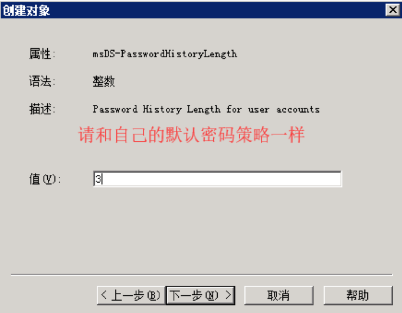
 
(4)```.msDS-PasswordComplexityEnabled```，对应组策略中的“密码必须符合复杂性要求”，也是一个布尔值，我们设置为“TRUE”;
 
 
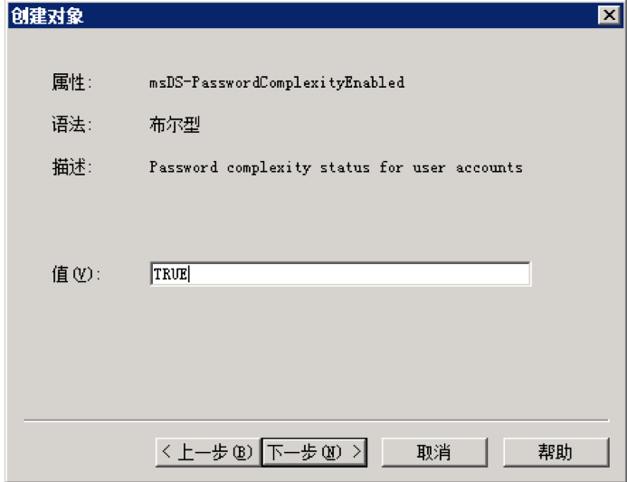
 
(5)```.msDS-MinimumPasswordLength```，设置密码长度最小值为8;

**注意：此处请和自己域密码策略一致**

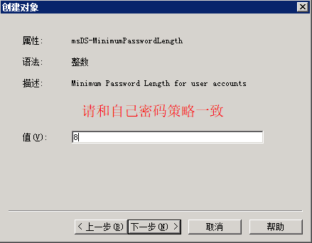 
 
(6)```.msDS-MinimumPasswordAge```，设置密码最短使期限为1:00:00:00(1天);

**注意：此处请和自己域密码策略一致**


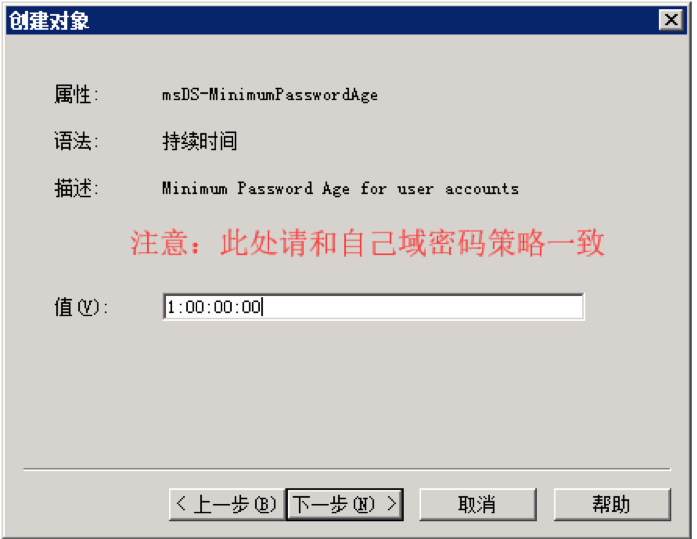
 
 
(7)```.msDS-MaximumPasswordAge```，设置密码最长使用期限为90:00:00:00(90天);

**注意：此处请和自己域密码策略一致**


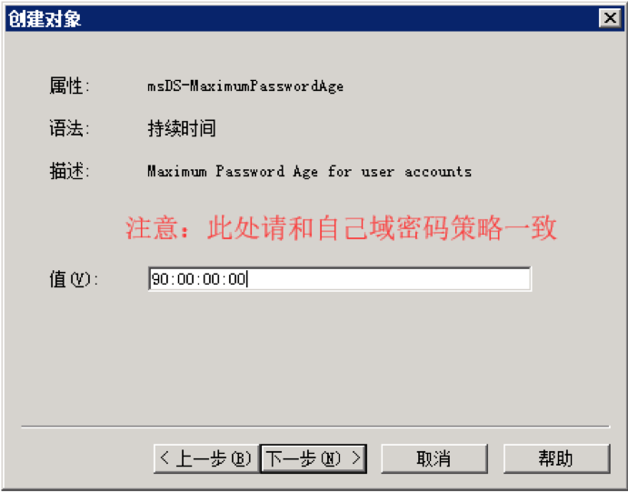
 
(8)```.msDS-LockoutThreshold```，设置帐户锁定阀值为0(可以范围0-65535);

**注意：关键步骤**


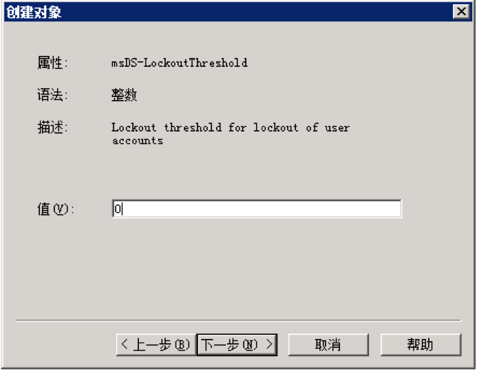
 
(9)```.msDS-LockoutObservationWindow```，设置复位帐户锁定计数器为0:00:00:00(00分钟);
 
 
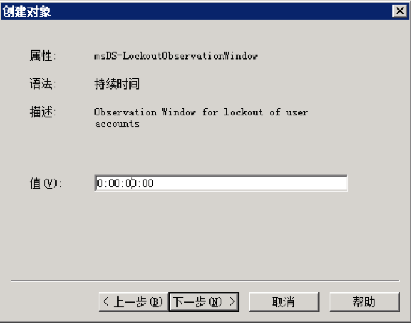

(10)```.msDS-LockoutDuration```，设置帐户锁定时间为0:00:00:00(00分钟)。
 

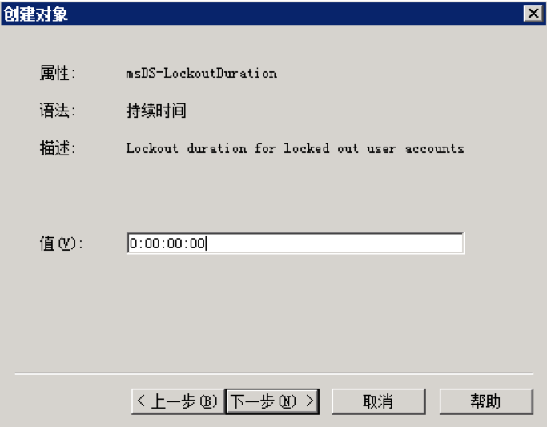

（11）接下来不要点击“完成”，点击“更多属性”
 
 
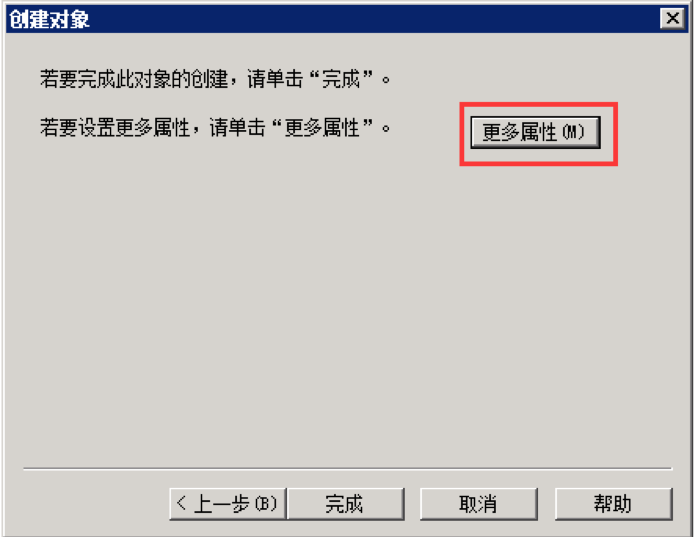

（12）
在“选择一个要查看的属性”处选择```msDS-PSOAppliesTo``` ，它用来设置此密码设置对象PSO所应用到的对象，只能链接到用户或全局安全组的 0 个或多个 DN。我将它连接到之前创建的PSOGroup安全组。完全以后点击“确定”。至此，PSO的创建、链接工作至此完成。（两个DC=后面的域名要根据实际情况来填写）
 
 
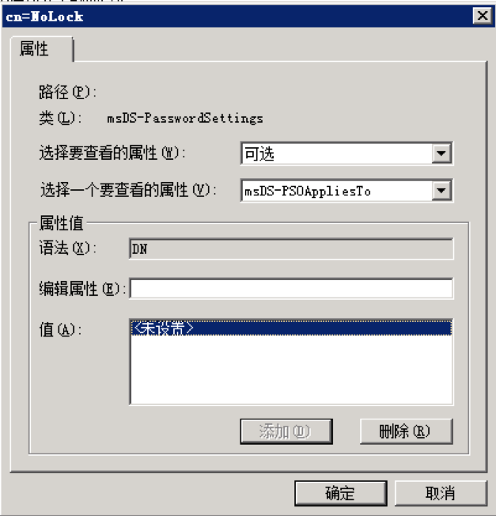
 
 
