# ITPortal

IT Portal 提供了用户自助界面和管理配置界面


## 部署

本系统需要`Python 3.X`+`MYSQL 5.x`支持

1. 创建DB并导入itdev-portal.sql

``` 
MariaDB [(none)]> create database itportal;
Query OK, 1 row affected (0.00 sec)

MariaDB [(none)]> use itportal
Database changed

MariaDB [itportal]>source itdev-portal.sql
```

2. 基础环境安装并启动 请参见:


[《Centos7+Python3+Django+Nginx+uWsgi部署》](../docs/python.md)


## 使用说明

安装完成以后请使用`administraor` 用户登陆系统,`administraor`用户的密码`ITPortal...123`

#### 后台配置
 
## 配置 
 
#### Mysql配置
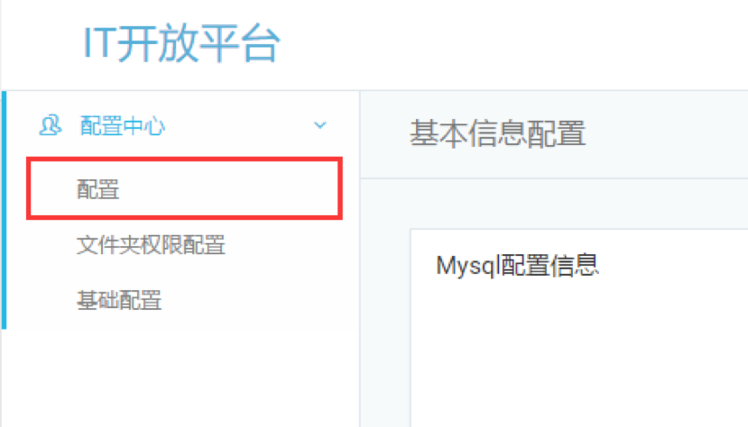

依次输入ip，账号，密码和端口号，点击测试链接通过后自动保存

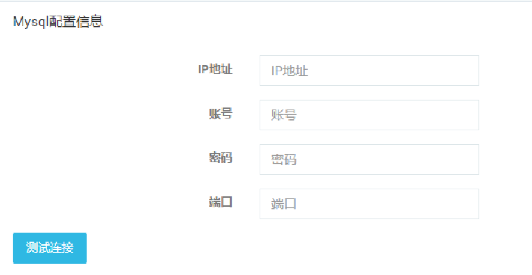


 
### IIS配置信息

用来调用接口类操作服务器数据，此处应填写发布`core`服务所在的的主机ip和端口
点击测试连接成功后自动保存
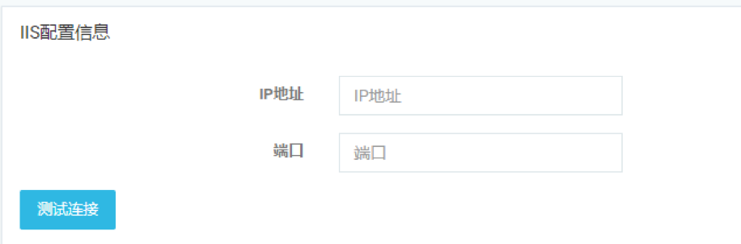
 
### AD配置信息
用在连接ad服务器进行操作时使用，此处需要填写ad域服务器的ip地址，拥有最大管理权限账号的（sAMAccountName）值，密码，域名，原始路径
 

### Exchange配置信息

连接exchange服务器进行操作时使用，需要填写ip地址，具有最大管理权限账号的（sAMAccountName）值，密码，域名

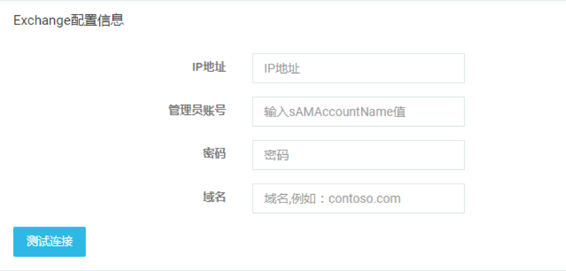
### IT人员隶属组配置信息

某些功能指定了只对IT人员可见，该配置指定IT人员所在群组的（sAMAccountName）值
 
 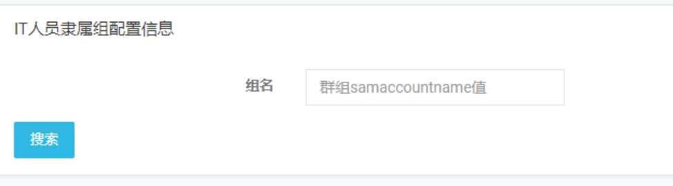
 
配置完成后刷新页面，可以添加，清空，删除成员
 
 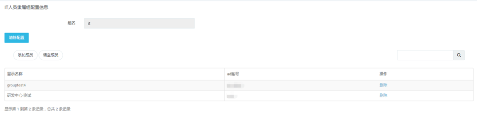
 
以下为IT人员可以查看部分隐藏项

1、系统日志
 
 
 
2.IT工具：账号解锁、账号防锁定、重置密码

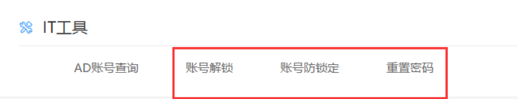
 
3.兼职账号：兼职账号申请、有效账号管理、管理员后台、申请权限管理（注意：兼职账号申请、有效账号管理，兼职组中的成员也具有此权限，请参照基础配置模块）

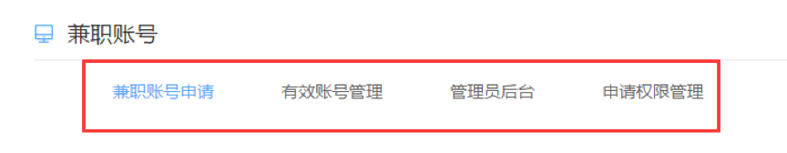
 
4.文件夹权限：文件夹权限管理、修改文件夹管理员、（注意：文件夹权限管理，文件夹管理员也具有此权限）


 
 
 ## 文件夹基本信息配置

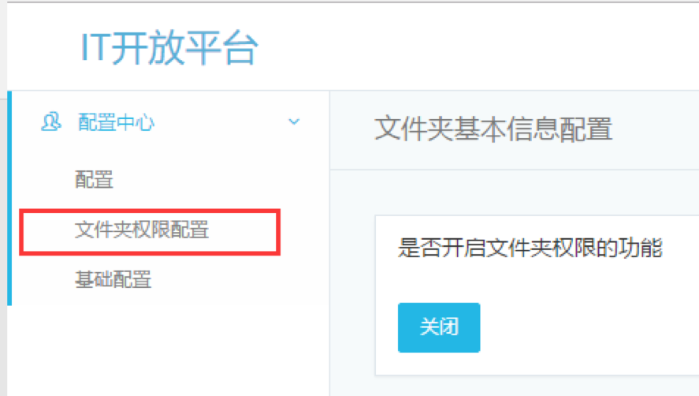

 
**前提条件** 

1.基本配置信息完成

2.在文件服务器(或具有所有管理员权限的的windows服务上）安装`DFSAPI`
配置项说明


 
注意:当关闭文件夹权限控制后，你无法在前台看到任何文件夹相关的页面


dfs_api :这个是安装API的服务器，这个服务器需要对文件夹具有最高权限
修改这个也会同步mysql数据库的账户密码到 API

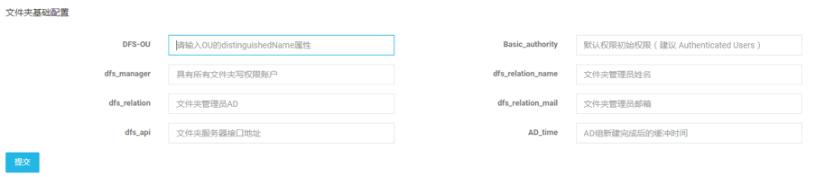
 
**重要：文件服务器—文件夹层级和权限控制**

1.	在网络共享中，共享的目录为第一层目录
2.	设置中，第一和第二层目录，所有同事都可以打开，权限控制放在第三层目录上面
 

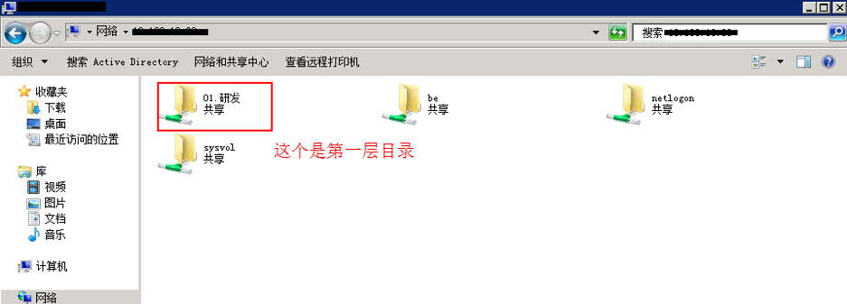
 
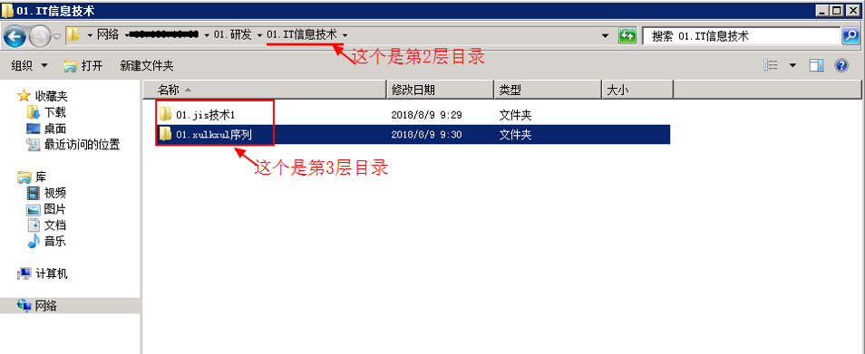

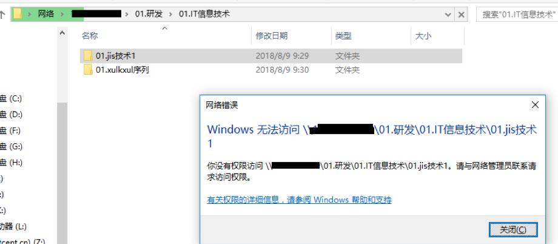
 
### 文件夹权限控制

在第三层目录上对目录，添加两个对应的AD组，通过对AD 组添加删除成员来进行管理权限


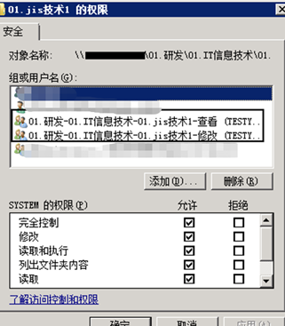
 
### 文件夹基础配置

1.	DFS-OU ： 是在AD存放文件夹权限组的OU 的DN属性 例：OU=DFS,OU=xxx,DC=xx,DC=xx


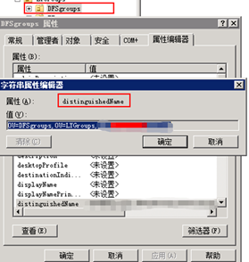
 
2.	Basic_authority ： 这个是设置的默认权限（用户的一层，二层的浏览权限） 例：Authenticated Users
3.	dfs_manager ：具有所有共享的文件夹的管理权限的域账户 （AD账户） 例：xxx
4.	dfs_relation ： 当文件夹没有管理员的时候设置的默认管理员（域账户，AD账户） 例：xxx
5.	dfs_relation_name ： 当文件夹没有管理员的时候设置的默认管理员的显示名称 例：xx部门-xxx
6.	dfs_relation_mail ： 当文件夹没有管理员的时候设置的默认管理员的邮箱 例：xxxxxx@XXX.com
7.	dfs_api : 安装控制文件夹权限的服务器地址 例 ：http://172.0.0.1:8081/
8.	AD_time ：AD文件夹权限组，新建好后的缓冲时间，单位秒 建议时间 60 例 ：60

### 文件夹权限初始化设置


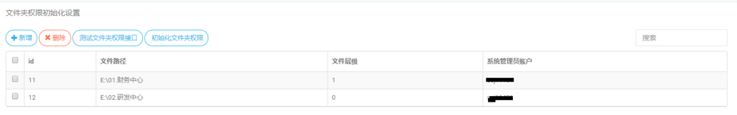
 
文件路径 ：安装文件API的服务器，上面对应的文件路径（支持映射网络驱动器路径） 例：E:\02.研发中心
 **重要：在安装文件API的服务器上,必须将所有需管理的共享目录,通过映射网络驱动器的方式,链接到该服务器**


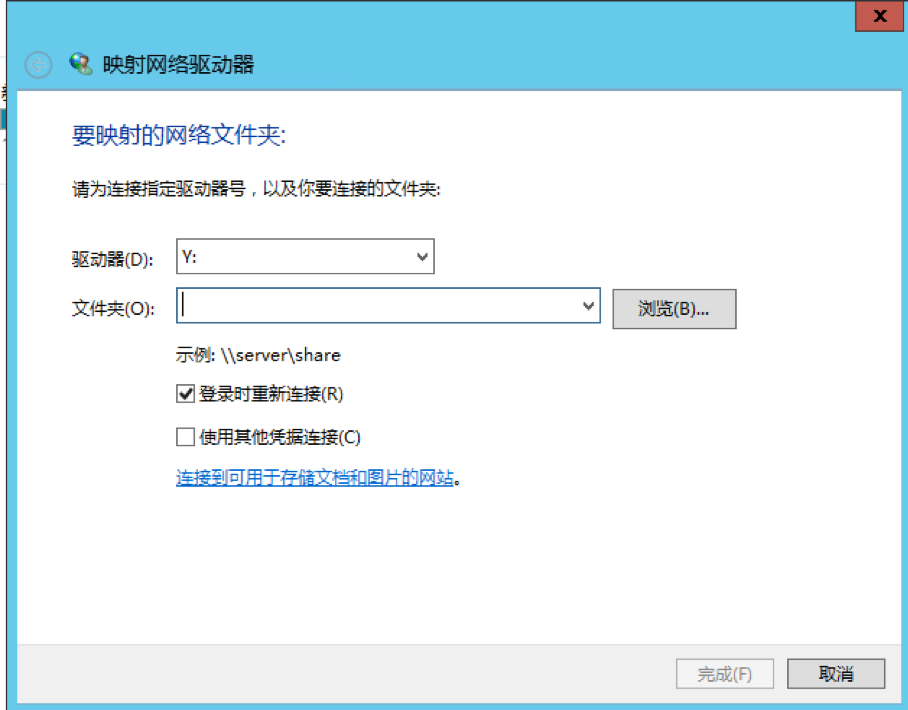
 
PS.当使用映射网络驱动器路径的时候：

1.控制文件夹权限的安装权限，必须具有所有文件夹的管理权限

2.可能添加权限会失败

**文件层级:** 只支持1和0，0层文件目录下面所有的文件夹都是 第一层目录
系统管理员账户，id : 功能未启用

测试文件夹权限接口 ： 对上面填写的 dfs_api : 安装控制文件夹权限的服务器地址 例 ：http://172.0.0.1:8081/， 进行测试

初始化文件夹权限：（权限会丢失，谨慎使用）

Q ：为什么要初始化文件夹权限

A： 规范和方便控制文件夹权限的层级 ，和对原有权限控制进行优化，生成相关的AD文件夹权限组，更新数据库数据，方便申请

Q：有什么注意点？
A：对照成部分原有的第一层目录，第二层目录，权限的变小，原有三层以下权限的失效 （权限肯定会丢失，谨慎使用）

## 基础配置
 

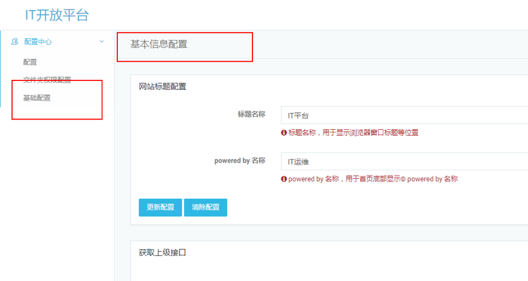

网站标题配置，用于显示浏览器窗口标题和底部的powered by 名称 
 
 
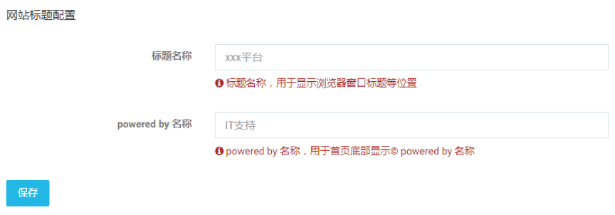

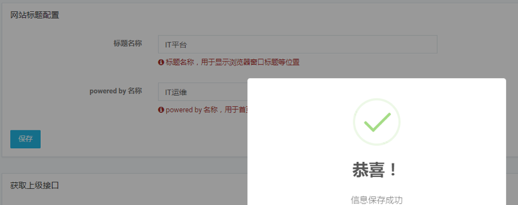
 
对应的页面位置如下图:


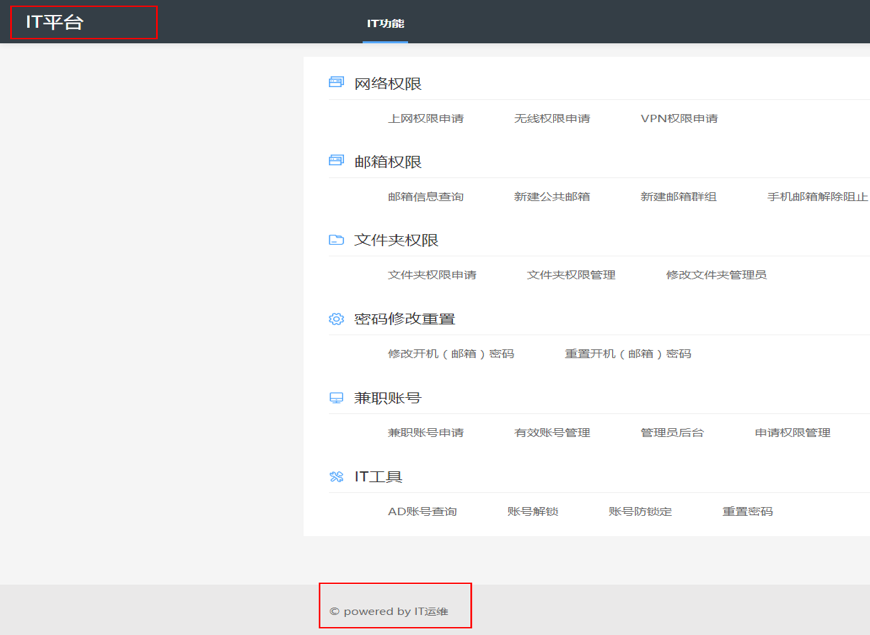
 

### 获取上级  获取上级为单选项，只能选择一个配置


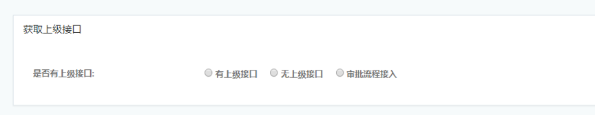
 
此配置选项用于用户申请申请网络权限，邮箱权限,DFS等权限的审批。
如配置上级接口，用户申请后会获取用户上级，以便上级审批
 
#### 有上级接口
该模式会调用外部API获取上级，接口必须为get 方法，该方法会传入 username 参数 

调用示例:

` http://otherapi/GetActiveSyncDevice?username=”username”
`

返回格式： 

```
{'ResultCode': 0,'List': [{'EmpCount': '域账号', 'Email': '邮箱地址', 'xxxx': 'xxxxx'}]}。ResultCode:0 代表接口调用成功，List中EmpCount代表上级AD账号，Email代表邮箱地址。
```

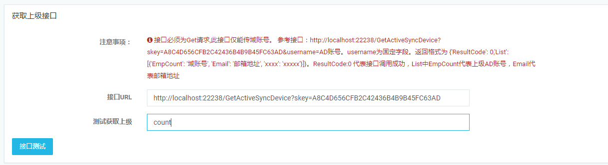


 

#### 无上级接口

如配置无上级接口，需填写固定审批人，用户申请的权限，都需要固定审批人审核。请填写正确的AD账号（sAMAccountName 值）

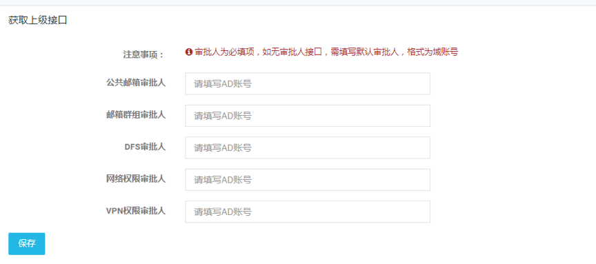


### 审批流程接入模式：

也可以和公司内部OA的workflow整合，系统提供两个接口
 
 
1.外部流程审批调用接口

* 配置审批流程接入后，当有用户申请一个审批单生成后，平台发起一个post请求，调用配置的外部接口，传递申请信息
* 请求URL部分为配置页面填写的**接收流程传入值url**
* 请求headers部分固定为**headers = { "Content-Type": "application/json" }**
```python
 { 
 "Content-Type": "application/json" 
 } 
```
* 请求body为
```python
{
"status":0, #固定为0
"message":
    {
    "id":"1", #申请单ID，此为唯一标识，审批回调时，使用此ID指定此申请单
    "username":"测试", #申请用户的ad账号，可根据此值获得用户审批人
    "displayname":"测试", #用户ad账号的显示名称
    "types":"测试", #用户申请单分类，此值和ID一起，作为审批回调参数
    "applytype":"测试", #申请权限名称
    "applydetail":"测试" #申请权限值
    }
}
```

***
2. 调用外部OA或其他workflow接口


* 当用户申请单审批状态发生变化时，外部平台调用此接口，用来做审批后的执行操作
* **URL：** http://平台发布ip+端口/api/approvalapi/
* body部分为
```python
{
"id":"1", #申请单ID，此值是外部接口里message里的id参数
"types":"测试", #用户申请单分类，此值是外部接口里message里的types参数
"status":"1" #审批意见（1：同意，0：不同意）
}
```
* 返回值部分为
```python
{
"isSuccess": True, #审批接口回调是否成功，如果不成功，需要根据message查看原因
"message": "审批意见已提交" #详情信息，如果isSuccess为True，则不需要关注此值
}
```

***

短信接口 配置用于推送短信非必配项
 
如配置短信接口，需先配置用户名转手机号接口。在配置短信接口
 


基础配置，

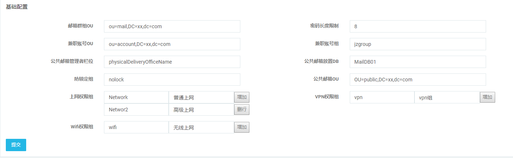

邮箱群组OU：用户申请邮箱群组，领导审批后账号新建放置的OU（请填写OU的 distinguishedName）
密码长度限制：用户修改密码提示限制。重置密码生成的长度
兼职账号OU：用户申请兼职账号，账号创建放置的OU （请填写OU的 distinguishedName）
兼职账号组： 此配置限制用户申请兼职账号，只有在此组中的成员，才有权限申请 （请填写组名）
公共邮箱管理者栏位： 此配置用于判断公共邮箱管理者。栏位内会写入管理者AD账号（请填写属性编辑器中的英文属性,不支持中文）
例如(physicalDeliveryOfficeName 对应办公室栏位)

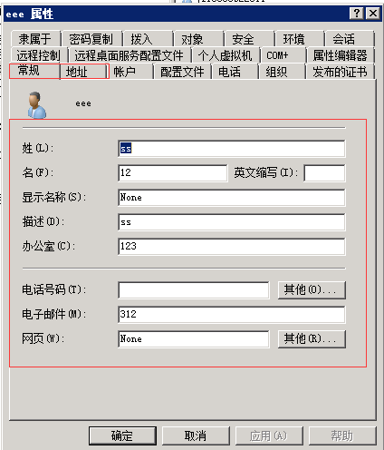

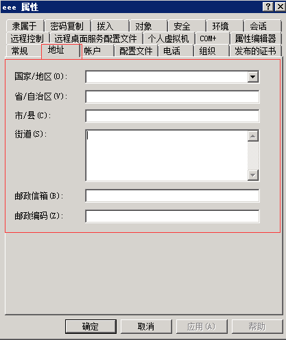

公共邮箱放置DB：此配置用于新建公共邮箱，公共邮箱新建的邮箱数据库（请填写ExchangeDB）
防锁定组：此配置用于账号被锁定，加入此组解锁（请填写组名）
公共邮箱OU: 此配置用户新建公共邮箱时，账号放置的OU （请填写OU的 distinguishedName）
上网权限组/VPN权限组/Wifi权限组：此配置用于用户申请上网权限/VPN权限/无线权限，判断上网权限。请 填写权限组名，与组名描述。可填写多个权限组名称。
 
OU请填写OU的distinguishedName属性
权限组名称请填写 组名

 


邮箱账号配置
此配置用于发送用户申请，领导审批发送邮箱提醒
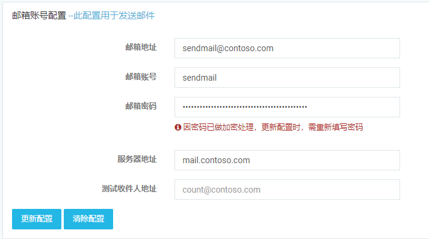
 

